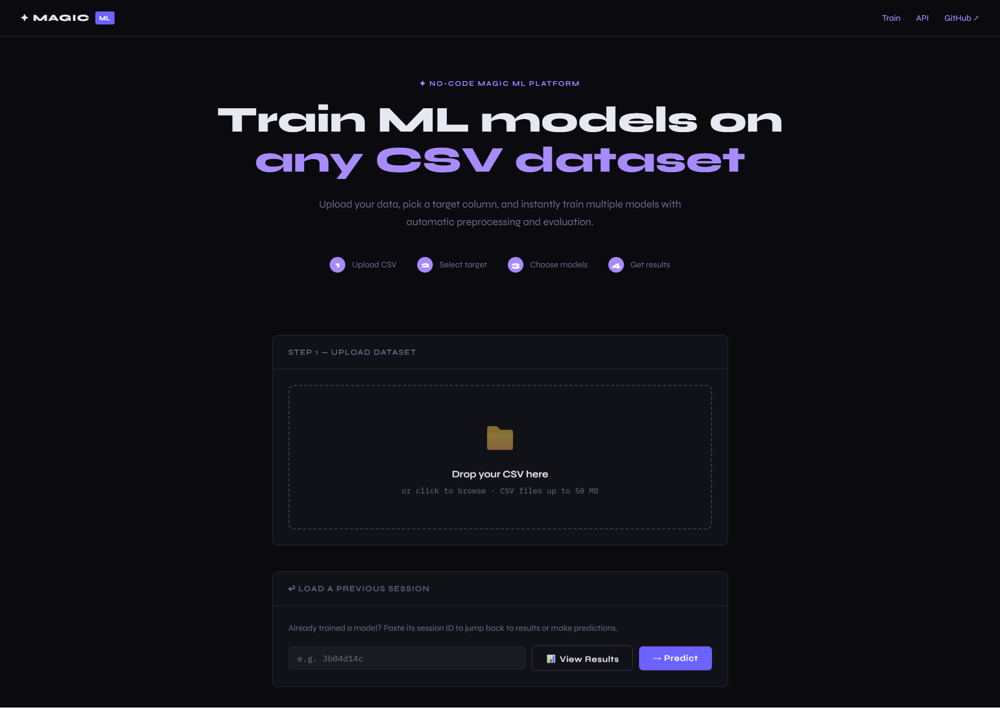
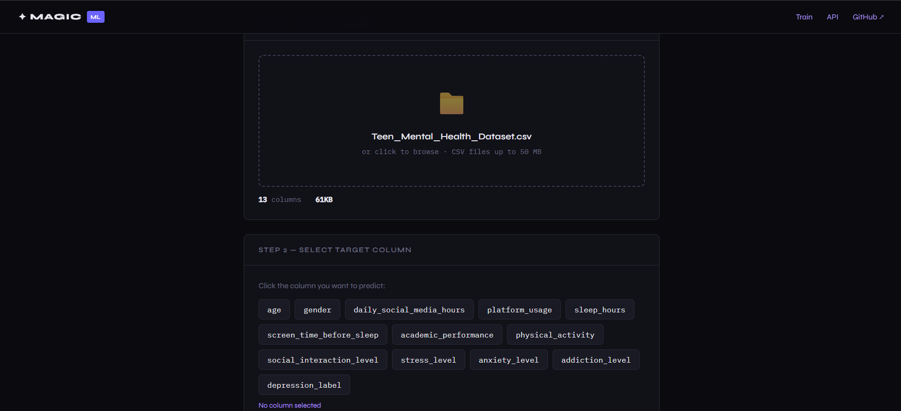
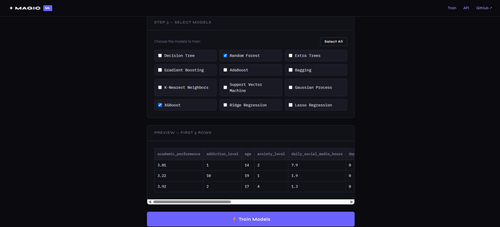
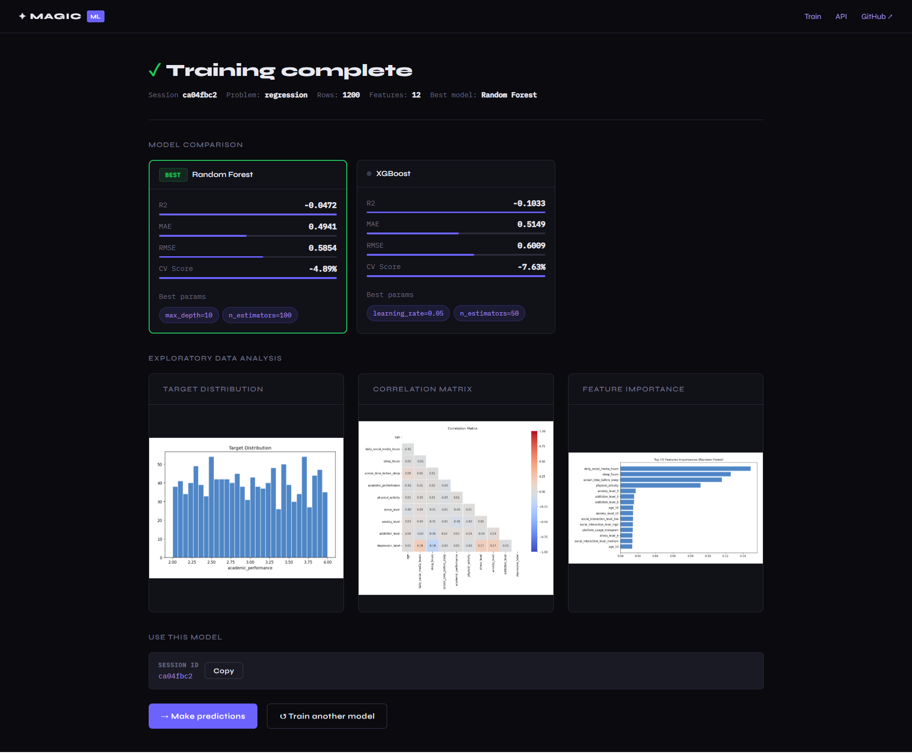

# ✦ Magic ML — AutoML Pipeline

A no-code web app that lets you train machine learning models on any CSV dataset. Upload your data, pick a target column, choose your models, and get evaluation results — no Python knowledge required.

---

## 📸 Preview



---

## ✨ What It Does

### Step 1 · Upload your dataset
Drag and drop any CSV file (up to 50 MB). You can also reload a previous training session using its session ID.


### Step 2 · Select a target column
Click the column you want to predict. The app auto-detects whether it's a classification or regression problem.



### Step 3 · Choose your models
Pick from a range of algorithms — Random Forest, XGBoost, SVM, KNN, Gradient Boosting, and more. A preview of your data is shown before training.



### Step 4 · View results
After training, see a side-by-side model comparison with metrics (R², MAE, RMSE, CV Score), EDA plots (target distribution, correlation matrix, feature importance), and the best hyperparameters found.



---

## 🗂️ Project Structure

```
ML-PIPELINE/
├── api/
│   └── app.py              # Flask app — all routes and API endpoints
├── src/
│   └── pipeline/
│       └── engine.py       # Core AutoML logic — preprocessing, training, evaluation
├── templates/              # HTML pages (index, results, training, predict)
├── sessions/               # Saved training sessions and model artifacts
├── uploads/                # Temporary uploaded CSV files
├── tests/
│   └── test_api.py         # API tests
└── requirements.txt        # Python dependencies
```

---

## 🚀 Getting Started

### 1. Clone the repo

```bash
git clone https://github.com/your-username/ml-pipeline.git
cd ml-pipeline
```

### 2. Create and activate a virtual environment

```bash
python -m venv .venv

# Windows
.venv\Scripts\activate

# macOS / Linux
source .venv/bin/activate
```

### 3. Install dependencies

```bash
pip install -r requirements.txt
```

### 4. Run the app

```bash
python api/app.py
```

Then open your browser at `http://localhost:5000`.

---

## 🐳 Running with Docker

```bash
docker build -t magic-ml .
docker run -p 5000:5000 magic-ml
```

---

## 🤖 Supported Models

| Model | Classification | Regression |
|---|---|---|
| Random Forest | ✅ | ✅ |
| XGBoost | ✅ | ✅ |
| Gradient Boosting | ✅ | ✅ |
| Extra Trees | ✅ | ✅ |
| AdaBoost | ✅ | ✅ |
| Bagging | ✅ | ✅ |
| Decision Tree | ✅ | ✅ |
| K-Nearest Neighbors | ✅ | ✅ |
| Support Vector Machine | ✅ | ✅ |
| Ridge Regression | ❌ | ✅ |
| Lasso Regression | ❌ | ✅ |
| Gaussian Process | ✅ | ✅ |

> XGBoost is optional — install it separately with `pip install xgboost` if needed.

---

## 🔌 REST API

The app also exposes a JSON API for programmatic use.

| Method | Endpoint | Description |
|---|---|---|
| `GET` | `/health` | Health check |
| `POST` | `/api/columns` | List columns from uploaded CSV |
| `POST` | `/api/problem_type` | Detect classification vs regression |
| `POST` | `/api/models` | Get compatible models for problem type |
| `POST` | `/api/train` | Train selected models |
| `POST` | `/api/predict/<session_id>` | Single prediction |
| `POST` | `/api/predict_batch/<session_id>` | Batch prediction from CSV |
| `GET` | `/api/session/<session_id>` | Get session metadata |

---

## 🧠 How It Works

1. **Upload** — CSV is parsed and columns are extracted
2. **Target detection** — the app infers binary classification, multiclass, or regression based on the target column
3. **Preprocessing** — numeric columns are scaled, categorical columns are one-hot encoded automatically
4. **Training** — selected models are trained with optional GridSearchCV for hyperparameter tuning
5. **Evaluation** — metrics are computed on a held-out test set, plus cross-validation score
6. **Session saved** — results and the best model are saved under `sessions/` so you can return to make predictions later

---

## 🧪 Running Tests

```bash
pytest tests/test_api.py -v
```

---

## 📋 Requirements

- Python 3.8+
- No API keys needed — everything runs locally

## ⚠️ Known Limitations

- Only CSV files are supported (no Excel, JSON, etc.)
- No database — sessions are stored as files under `sessions/`
- Training progress is tracked in-memory and resets on server restart
- Very large datasets may be slow depending on selected models and hyperparameter search
